# Holding Company Frontend Masterplan v3

Date: 2026-06-15
Scope: Frontend only (design system, page architecture, interaction model, and implementation blueprint)
Reference model: First Pacific structural discipline and corporate communication style

---

## 1. Frontend Vision

Build a premium, restrained, institutional website that feels boardroom-ready while still modern and highly usable.

Design principles:

- Parent brand first, business sectors second.
- Sector-led architecture over service clutter.
- Clarity over decoration.
- Data-backed credibility over marketing claims.
- Scalable layout system for future subsidiaries and countries.

Core positioning line:

Building long-term value across essential and growth industries.

---

## 2. What We Are Replicating from the Reference Site

The objective is to mirror the logic and discipline, not clone branding.

Key patterns to carry over:

- Corporate-first navigation and information hierarchy.
- Deep page tree that supports governance, updates, and archive content.
- Dedicated historical timeline section similar to Key Corporate Events.
- Content blocks that feel investor-grade and durable over time.
- Footer and utility links that reinforce trust and compliance.

What to avoid:

- Startup hero language.
- Heavy motion and visual noise.
- Consumer e-commerce patterns.
- Generic template sections that look interchangeable.

---

## 3. Frontend Information Architecture

Top-level nav:

- Home
- About Us
- Our Sectors
- Leadership and Governance
- Markets
- News and Insights
- Contact

Utility and legal nav:

- Privacy Policy
- Terms of Use
- Cookies Policy
- Corporate Information

---

## 4. Homepage Composition Blueprint

Homepage sections in exact order:

1. Hero: Parent identity, positioning statement, two primary CTAs.
2. Group introduction: concise paragraph of holdco model and operating intent.
3. Sector overview grid: five core sectors plus optional Emerging Ventures placeholder.
4. Portfolio logic: three strategic grouping bands to show coherence.
5. Markets footprint: Australia base with regional growth outlook.
6. News and insights preview: latest three items.
7. Key Corporate Events teaser: link to full events timeline page.
8. Final CTA strip: partnership and strategic enquiry routing.

Homepage interaction rules:

- Sticky header after first scroll threshold.
- Sector cards elevate on hover with subtle shadow and line accent.
- News cards maintain fixed height for visual balance.
- CTA bar remains minimal and contrast-driven.

---

## 5. Key Corporate Events Frontend System

This is the most important reference pattern requested.

### 5.1 Purpose

Provide an institutional timeline of company milestones to build credibility, context, and historical depth.

### 5.2 Layout Model

Desktop layout:

- Left rail: year anchors and jump navigation.
- Center column: timeline spine with event markers.
- Right column: event cards or expandable details.

Tablet and mobile layout:

- Single-column timeline stack.
- Sticky year filter at top.
- Expand and collapse cards for readability.

### 5.3 Event Card Structure

Each event card should include:

- Year or date.
- Event headline.
- One to three sentence summary.
- Optional tags: sector, market, transaction type.
- Read more action if detailed page exists.

### 5.4 Filtering and Utility

Filters:

- Year range
- Sector
- Region

Actions:

- Reset filter
- Copy shareable URL with filter state
- Download printable timeline PDF later phase

### 5.5 Animation and Motion

- Timeline markers animate in with subtle fade and vertical reveal.
- No parallax and no heavy scroll effects.
- Motion duration stays in the 180ms to 280ms range.

---

## 6. Page-by-Page Frontend Wireframe Specs

### 6.1 About Us

Sections:

- Hero statement
- Corporate profile narrative
- Group structure visual
- Mission, vision, and principles
- Link blocks to leadership and governance pages

### 6.2 Our Sectors Overview

Sections:

- Sector framework introduction
- Sector cards grid
- Strategic grouping block
- Cross-sector collaboration note

### 6.3 Sector Detail Template (repeatable for all sectors)

Sections:

- Hero + positioning line
- Overview
- What We Do
- Core capabilities list
- Why It Matters
- Sector-specific enquiry CTA

### 6.4 Leadership and Governance

Sections:

- Governance philosophy
- Leadership profiles grid
- Oversight and accountability model
- Compliance and policy links

### 6.5 Markets

Sections:

- Current operating base
- Priority regions and growth thesis
- Region cards with status badges

### 6.6 News and Insights

Sections:

- Featured story
- Latest posts grid
- Category filters
- Archive pagination

### 6.7 Contact

Sections:

- Contact details and office information
- Routed enquiry form
- Consent and privacy note
- Expected response time block

---

## 7. Component Library (Frontend)

Core components:

- GlobalHeader
- MegaNav
- HeroCorporate
- SectorCard
- PortfolioLogicBand
- MarketsFootprintPanel
- InsightsCard
- TimelineEvents
- LeadershipCard
- ContactRoutingForm
- LegalFooter
- CookieConsentBar

Component standards:

- All components accept theme tokens only.
- No hard-coded spacing or colors.
- Accessible labels and focus states mandatory.
- Empty states and error states required for cards and lists.

---

## 8. Frontend Data Contracts and Schema

Frontend-facing content types:

- Page
- Sector
- Event
- Insight
- LeadershipProfile
- Market
- ContactRoutingRule

Key frontend requirements:

- Slug-driven dynamic routing.
- Type-safe content mapping for render modules.
- Graceful fallback for missing optional fields.

---

## 9. Design Tokens and Visual System

Token categories:

- Color palette: corporate navy, slate, mist, neutral, one restrained accent.
- Typography: high-legibility serif and sans pairing for corporate authority.
- Spacing scale: 4, 8, 12, 16, 24, 32, 48, 64.
- Radius scale: 0, 4, 8, 12.
- Shadow scale: subtle only.

Visual behavior:

- Section rhythm driven by whitespace.
- Strong heading hierarchy using clear weight contrast.
- Borders and dividers used to frame institutional content.

---

## 10. Responsive Strategy

Breakpoints:

- Mobile: 360 to 767
- Tablet: 768 to 1199
- Desktop: 1200+

Responsive rules:

- Navigation collapses into a structured drawer with grouped categories.
- Timeline converts from multi-column to single-column stack.
- Cards maintain equalized heights only on desktop.
- Tap targets minimum 44 by 44.

---

## 11. Accessibility and UX Quality

Frontend acceptance:

- WCAG AA color contrast.
- Keyboard access across nav, filters, and timeline interactions.
- Visible focus indicators.
- Semantic heading levels and landmarks.
- Reduced motion support for all animated components.

---

## 12. SEO Frontend Requirements

Technical requirements:

- Single H1 per page.
- Clean slug routing.
- Canonical tags.
- Open Graph and Twitter metadata.
- Schema markup for Organization, BreadcrumbList, and Article.
- XML sitemap and robots controls.

Content-rendering requirements:

- Proper alt text handling.
- Preview cards that include structured metadata.
- Fast loading media and lazy rendering below fold.

---

## 13. Frontend Delivery Flow

Sprint model:

- Sprint 1: IA and wireframes
- Sprint 2: visual system and component scaffolding
- Sprint 3: page implementation
- Sprint 4: events timeline and news templates
- Sprint 5: responsive polish and accessibility hardening
- Sprint 6: final QA and production readiness

---

## 14. What Will Be Delivered in Frontend Phase

Deliverables:

- Full responsive frontend for all phase-1 pages.
- Production-ready component library.
- Key Corporate Events timeline frontend module.
- Navigation system with desktop and mobile behaviors.
- Styled news and insights listing and detail templates.
- Contact form frontend with validation states and routing fields.
- SEO metadata integration hooks.
- Accessibility-ready interaction patterns.

Not included in this phase:

- Backend business logic implementation.
- Final CMS provisioning and editorial workflows.
- CRM deep integration.
- Multilingual implementation.

---

## 15. Final Frontend Recommendation

Proceed with a corporate design language that matches the structural seriousness of First Pacific while introducing a cleaner, more modern interaction layer.

The highest-impact element should be the Key Corporate Events timeline system, implemented as a reusable, filterable, and future-proof frontend module.
