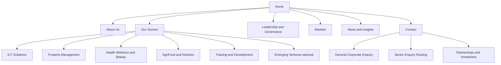
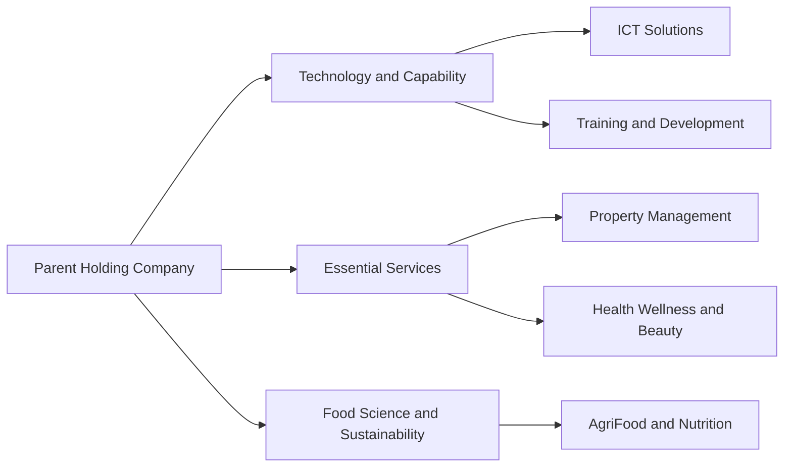
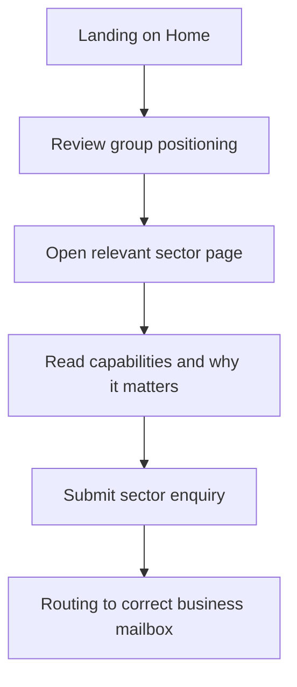
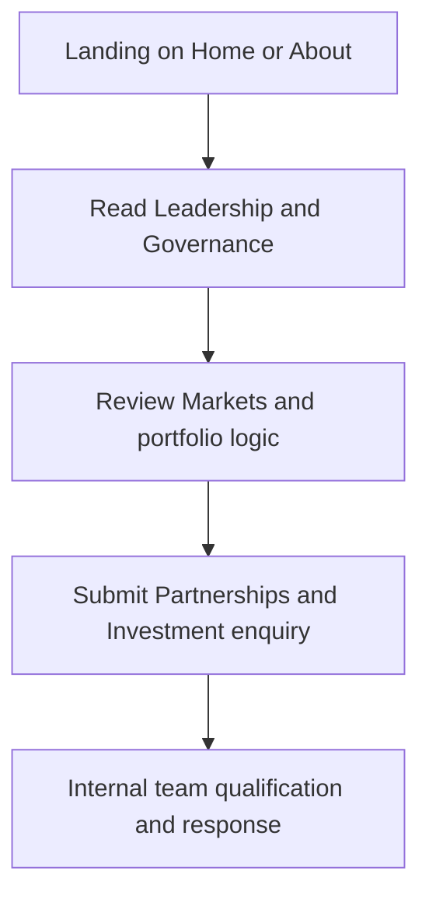
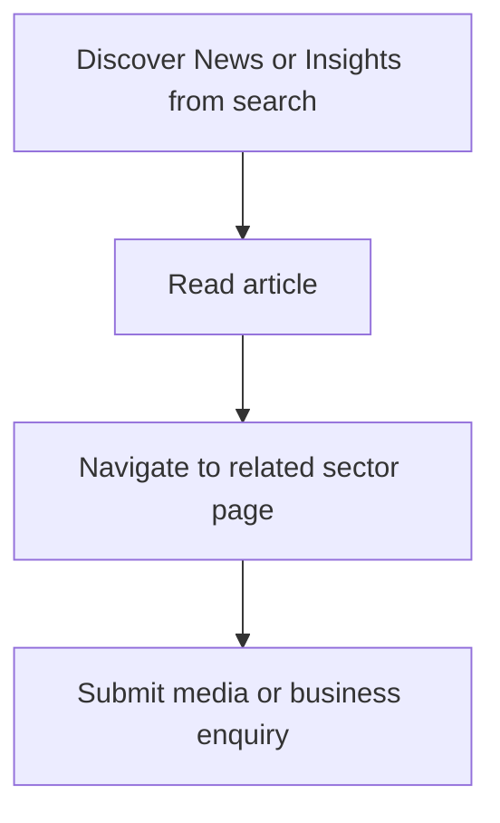
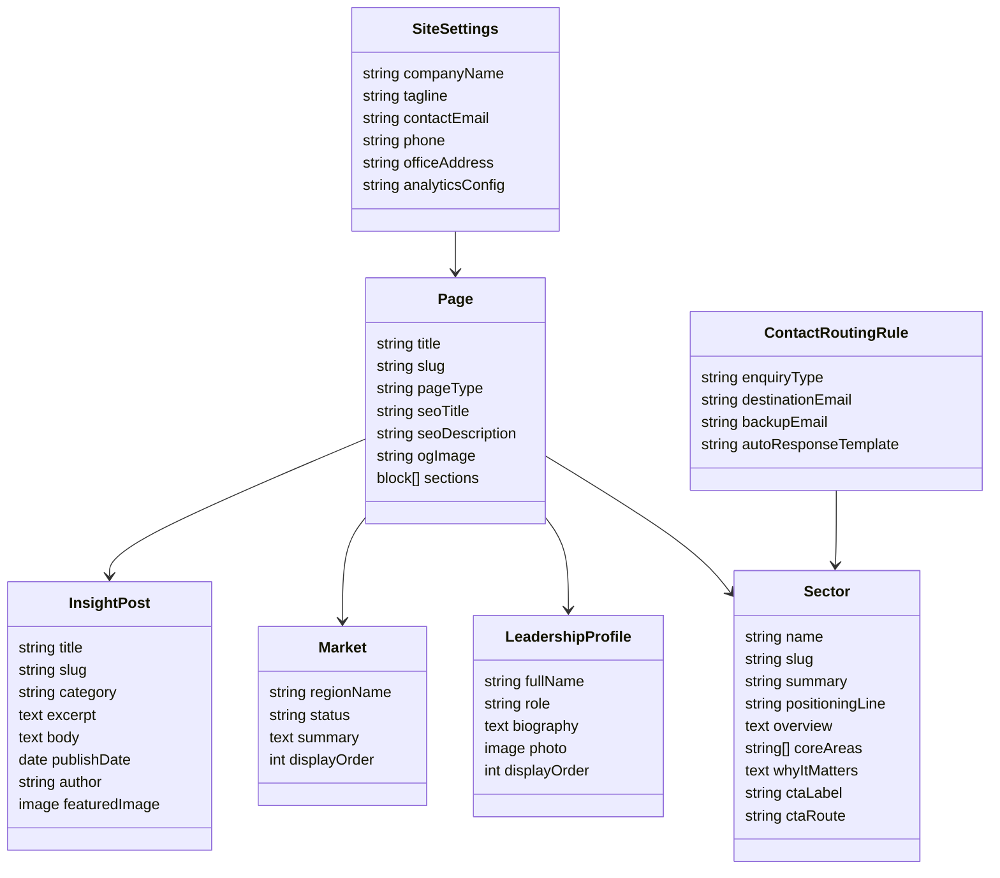
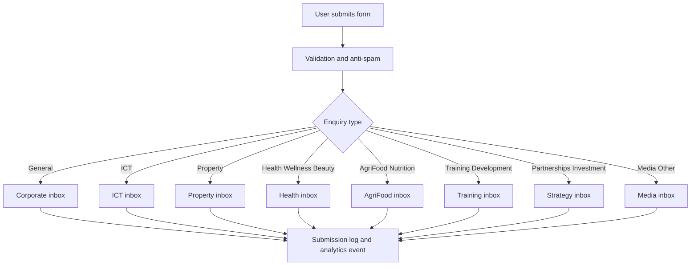
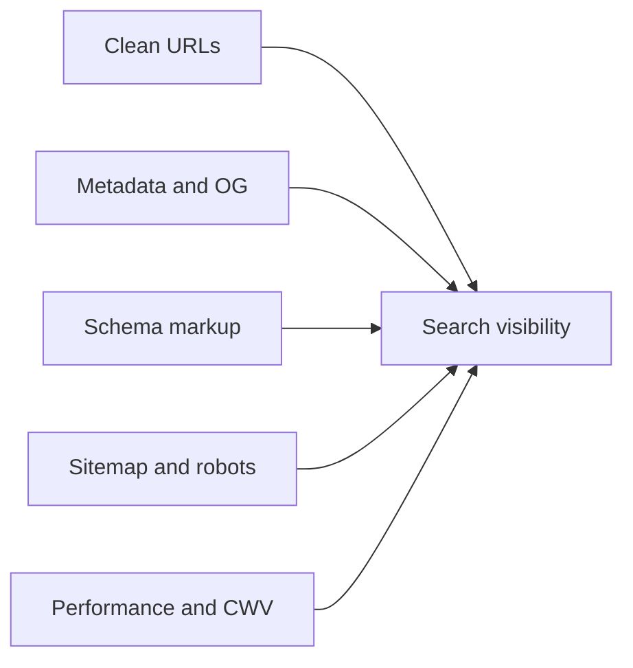
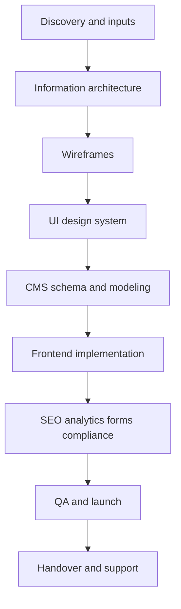
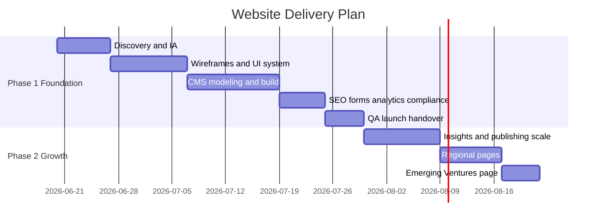

# Holding Company Website Blueprint v2

Prepared date: 2026-06-13  
Prepared for: Diversified multi-sector holding company

## 1) Vision

Build a premium, listed-style corporate platform that presents one strong parent identity and multiple business divisions under a disciplined structure.

Positioning line:

Building long-term value across essential and growth industries.

## 2) Strategic Outcome

The website should function as:

- a trust layer for partners, investors, and institutional stakeholders,
- a sector navigation system for business discovery,
- a lead-routing engine for qualified enquiries,
- a scalable content platform for growth into countries, subsidiaries, and insights.

## 3) Recommended Stack

- Frontend: Astro
- CMS: Sanity
- Deployment: Cloudflare Pages or Vercel
- Forms: Serverless endpoint with anti-spam and routing rules
- Analytics: GA4 with event tracking

Why this stack:

- excellent Core Web Vitals,
- high SEO control,
- modular and scalable content architecture,
- editor-friendly without layout breakage.

## 4) Site Architecture

## 5) Portfolio Logic Diagram

## 6) Primary User Flows

### Flow A: Partner or Enterprise Client

### Flow B: Investor or Strategic Counterparty

### Flow C: Media and Search Visitor

## 7) Content Model and Schema

## 8) Form Routing Flow

## 9) SEO System Map

## 10) Build and Delivery Flow

## 11) Delivery Timeline

## 12) Client Deliverables Pack

- Information architecture and sitemap.
- Responsive UI design system.
- Astro frontend implementation.
- Sanity CMS configuration and content model.
- Sector templates and reusable page modules.
- Contact routing with anti-spam.
- SEO foundation and page-level controls.
- Analytics and cookie consent integration.
- Legal pages setup.
- Editor guide and technical handover notes.

## 13) What the Client Receives at Launch

- Complete production-ready website.
- CMS admin access and editor roles.
- Reusable templates for future sectors and regions.
- Performance-tuned pages and SEO baseline.
- Routing-ready contact workflow.
- Documentation for content updates and governance.

## 14) Inputs Needed to Start Immediately

- Final company name and approved logo.
- Leadership bios and profile photos.
- Contact and office details.
- Legal text for privacy, terms, cookies.
- Preferred brand tone and typography direction.
- Approval of homepage and sector copy.

## 15) Final Recommendation

Proceed with Astro plus Sanity as the long-term digital foundation. This gives the strongest balance of speed, SEO, scalability, governance, and marketing readiness for a multi-sector holding company.
